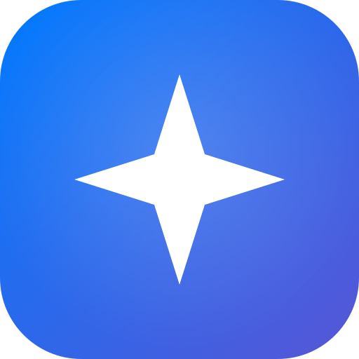
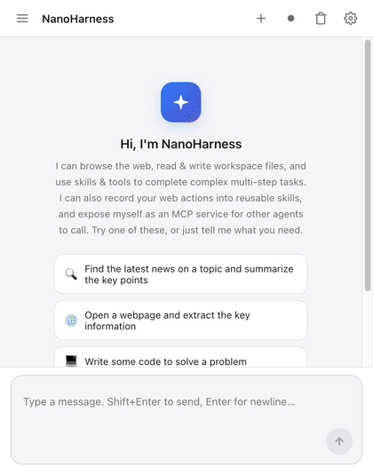
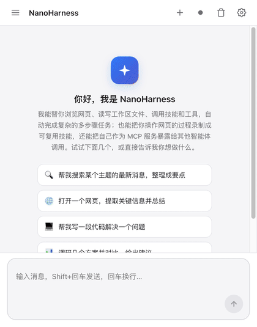

# NanoHarness

> A Hermes-like, self-evolving AI agent harness — running entirely inside Chrome, no local server required.
>
> [中文文档 / Chinese](README_zh.md)

  

**NanoHarness** is a pure Chrome-extension AI agent harness: an agent loop, browser automation, a workspace filesystem, a skill system, **memory & self-evolution** — and it can expose itself as an **MCP server** for other agents to call. Everything runs inside the browser; no local server needed.

---

## ✨ Highlights

### 🧠 Agent intelligence — Hermes-like memory & self-evolution

NanoHarness doesn't just call tools — like Hermes, it **learns who you are and gets better at your tasks**:

- **Two-channel memory**: remembers *who you are* (preferences, habits) and *environment conventions/pitfalls* across sessions, so you never repeat yourself.
- **Skill self-evolution**: after finishing a reusable task, it proactively saves it as a skill, then reuses it later. Skills accumulate — the agent gets better at your specific work.
- **Automatic context compression**: long conversations are auto-summarized so the context window never overflows — long tasks don't "lose memory".
- **Asks only when it matters**: decides low-stakes choices itself; pauses with options only when there's a real trade-off.

### 🌐 Browser automation

Drive the browser over CDP: open/switch tabs, read page content, click, fill forms, screenshot — 20+ browser tools. The agent can genuinely *see* and *operate* your browser.

### ⏺️ Action recording

Record your clicks, typing, scrolling and hovering into a reusable skill. Next time, just say it in chat and the whole flow replays automatically.

### 🔌 Expose as an MCP server

Expose the extension as a standard **MCP server** (Streamable HTTP). Claude Desktop, Cursor, or any MCP client can call your browser, workspace files and skills.

### 🛠️ Configurable skills & MCP

Add/remove/edit skills and configure remote MCP servers (HTTP/SSE) in Settings. Supports OpenAI-compatible and Anthropic protocols — DeepSeek, OpenAI, Claude, Moonshot, GLM, Qwen, and more.

---

## 🎬 Demo

Both GIFs walk through the same flow: ask "Who are you?" → "Open bing" → browse every Settings tab (with token usage).

**English:**

**中文 / Chinese:**

## 📦 Install

1. Clone: `git clone https://github.com/anyforge/nanoharness.git`
2. Open Chrome and go to `chrome://extensions`
3. Turn on **Developer mode** (top-right)
4. Click **Load unpacked** and select this repository's root folder
5. Click the NanoHarness toolbar icon to open the side panel

## 🚀 Quick start

1. Side panel → ⚙ Settings → **Model**, fill Base URL / API Key / model (presets fill most of it), save.
2. Back in chat, just say what you want, e.g. "open this page and extract the key points".
3. To turn your own actions into a skill: hit Record → use the page normally → stop → save as a skill.

---

## ⚠️ Disclaimer

NanoHarness is an automation tool. It genuinely operates the browser and calls external LLMs and MCP services. **Do not use it where you don't understand the consequences** — e.g. around accounts, payments, private data, or production systems. You are responsible for whatever it does on your behalf. The software is provided "as is", without warranty of any kind; the author assumes no liability for any direct or indirect loss.

## 📄 License

[AGPL-3.0](LICENSE) © [anyforge](https://github.com/anyforge)
